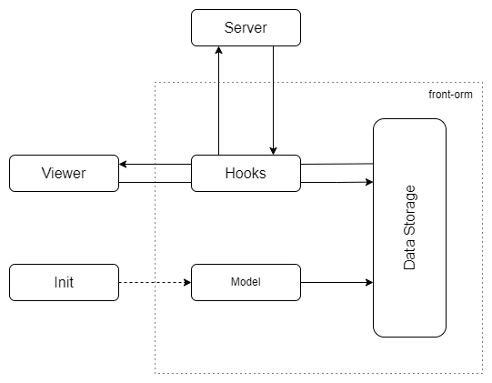
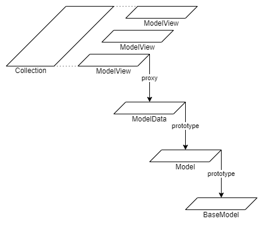

# front-orm

The package is designed for easy-to-use receipt, storage, refreshing and updating of data received from the server

## Installation

```bash
npm install front-orm
```

## Quick Start

```bash
npm install front-orm
```

#### Importing

```javascript
import {EntityManager} from "front-orm";
```

#### Create entity manager

```javascript
const em = new EntityManager(/* setReactivity */)
```

You can add object tracking or a reactivity creation function. For example, use watch-object

```bash
npm install watch-object
```

```javascript
import {watch} from "watch-object";

const setReactivity = (data) => {
  if (!Array.isArray(data)) {
    watch(data, 'name', (newVal, oldVal) => {
      console.log('obj name set', newVal, ' oldVal:', oldVal)
    })
  }
  return data
}
```

#### Create models

```javascript
// You can also import fields classes
const PrimaryKey = em.defaultClasses.fields.PrimaryKey
const StringField = em.defaultClasses.fields.StringField
const NumberField = em.defaultClasses.fields.NumberField
const CollectionField = em.defaultClasses.fields.CollectionField
const EntityField = em.defaultClasses.fields.EntityField

function Author(em) {
  return {
    id: new PrimaryKey(em),
    name: new StringField(em),
    age: new NumberField(em),
    books: new CollectionField(em, 'Book')
  };
}

function Book(em) {
  return {
    id: new PrimaryKey(em),
    name: new StringField(em),
    author: new EntityField(em, Author.name),
  };
}
```

#### Add a model to the Entity manager

```javascript
// You can also import classes
const Collection = em.defaultClasses.types.Collection
const Entity = em.defaultClasses.types.Entity

em.setModel(Author, {
  find: new Entity(em, (value) => {
    // Your request to the server
    return responseData
  }),
})
em.setModel(Book, {
  findSomeThing: new Collection(em, (value) => {
    // Your request to the server
    return responseData
  }),
})
```

#### Add hooks that will be used for all models

```javascript
em.setHooks({
  get(model, pk) {
    /*
     Your request to the server
     return the data corresponding to the model  
    */
  },
  create(modelData, value) {
    /*
     Your request to the server
     return the primary key
    */
  },
  update(modelData, value) {
    /*
     Your request to the server
     return the primary key
    */
  },
  delete(modelData, pk) {
    /*
     Your request to the server
     return the primary key
    */
  },
})
```

#### Use package api

```javascript
const author = await em.repositories.Author.find(authorParams)
const booksCollection = await em.repositories.Book.findSome(bookParams)
const book = booksCollection[0]

const newAuthor = em.post(someNewValue, em.models.Author)
em.put(someUpdatingValue, book)
em.flush()
```

## Demo

```bash
git clone https://github.com/bd2051/front-orm-quick-example.git
cd front-orm-quick-example
npm install
npm run serve
```

## Overview

The main goal of the library is to quickly create a data processing system from a server with Restful API. 
The library is suitable for small applications and prototypes.

The data storage uses an ORM design. When calling the missing property, data is requested from the server.

The library implies the use of data reactivity but does not contain it.

For full implementation, signals from the server about updating data are required.
Use websockets, sse or long/short polling.

The scheme of the library is shown in the figure



### Model

To initialize the model, you need to create a model function that returns a set of model fields

```javascript
function Book(em) {
  return {
    id: new PrimaryKey(em),
    name: new StringField(em),
    page: new NumberField(em),
    stories: new CollectionField(em, 'Story', (value) => value.id),
    author: new EntityField(em, 'Author', (value) => value.id)
  };
}
```

The function name is used as the model name.

#### Fields classes

For all fields, the first parameter is an instance of the entity manager.

***PrimaryKey*** is a required field. Used for identification and requests.

***StringField*** is used for a regular string field.

***NumberField*** is used for a regular number field. Currently, no different from StringField.

***BooleanField*** is used for a boolean field. Currently, no different from StringField. See [Why beta](#why-beta-version)

***CollectionField*** is used to associate OneToMany or ManyToMany with another entity.

The second parameter is the name of the associated entity.

The third parameter is a function for bringing an entity object to the primary key.
By default 
```javascript
(pk) => pk
```

Example:

Data received from the server for the entity Book
```javascript
const book = {
  id: 1,
  stories: [{id: 1}, {id: 10}, {id: 11}],
  ...otherFields  
}
```
Then the function should look like this
```javascript
const convertValueToPk = (value) => value.id
```

If the data from the server looks like this

```javascript
const book = {
  id: 1,
  stories: [1, 10, 11],
  ...otherFields  
}
```
you can use the default function 
```javascript
(pk) => pk
```

***EntityField*** is used to associate OneToOne or ManyToOne with another entity. The parameters are similar to ***CollectionField***.

#### Model initializing

To initialize the model, there is a ***setModel*** method

```javascript
em.setModel(Book, {
  find: new Entity(em, (value) => {
    // Your request to the server
    return responseData
  }),
  findAll: new Collection(em, (value) => {
    // Your request to the server
    return responseData
  }),
})
```

The first parameter is a [model function](#model)

The second parameter is needed to create a model repository. It is an object with the ***Entity*** and ***Collection*** classes

***Entity*** and ***Collection*** are classes for determining the response from the server.

For both classes, the first parameter is an instance of the entity manager,
and the second is a *callback* with custom requests to the server. The *callback* parameter can be any.

*Callback* response:

- for ***Entity***, an object with model fields must be returned
- for ***Collection***, an array of objects with model fields must be returned

#### Data storage

The main interaction with data occurs through the ***ModelView*** and the ***ModelView collection***.

The structure of the data storage object is shown in the figure.



The ***BaseModel*** contains methods used at higher levels.

- **$em** is an instance of the entity manager
- **$getName** is a function that returns the model name
- **$getPkName** is a function that returns the name of the primary key
- **$refresh** is a function for refreshing data from the server
- **$get**, **$create**, **$update**, **$delete** calls the corresponding entity manager hook

The ***Model*** object is created when initializing the [model function](#model) based on the prototype ***BaseModel***.
Contains the same fields as the model function.

The ***ModelData*** object is the main data storage element.
Based on the prototype ***Model***. Filled with data from the server based on the model fields.
A link to the corresponding ***ModelData*** is placed in the relationship field.
If there is no data, an instance of the class Empty is assigned to the field.

***ModelView*** is based on the Proxy class with the ***ModelData*** target object.
When accessing properties, either the value of the target object field or the ModelView of the associated object is returned.
If the value of the target object field is equal to an instance of the Empty class, the 'get' hook is called.
The assignment operation does not work, use the **put** method of the entity manager to change the data.

***ModelView collection*** is an array of ModelView objects.
Using the methods 'push', 'pop', 'shift', 'unshift' will cause an error.
To change the data, the **put** method of the entity manager is used

###### Repository

The ***Repository*** stores all methods of getting data from the server added during initialization of the model.

Getting access to the ***Repository***
```javascript
const repository = em.repositories[modelName]
```
or
```javascript
const repository = em.getRepository(modelName)
```

Public properties and methods:
- $em - instance of the entity manager
- $model - instance of ***Model***
- $refreshCollection - a method for getting refreshed data from the server

###### Garbage collection

Memory is freed automatically by the garbage collector and does not require additional actions from the programmer.
To do this, most of the internal relationships between data are implemented on the basis of WeakSet, WeakMap and WeakRef.
Thus, the only live references to the data are ***ModelView*** and ***ModelView collection*** obtained using the entity manager.
Excluding them from memory is a condition for starting the garbage collector for this data.

**<u>Note:</u>** The js garbage collector has a complex logic of operation, so even without live references, the object can continue to be in memory for some unspecified time.

#### Hooks

list of hooks used:

- preFlush
- get
- create
- update
- delete

All hooks except 'get' are triggered during the execution of the 'flush' method.
'Get' is run in all cases when the Data Storage did not have the necessary data.

***preFlush*** is designed for manipulating commits before launching the rest of the hooks. Read more about commits below.
- The input parameter is an array of commits.
- Waiting for the return of an array of commits or an empty array

***get*** is used to get missing data in ***ModelData***
- Input parameters:
  - ***Model***
  - primary key
- Waits for the return of an object with fields similar to the ***Model***

***create*** is designed to send information about the creation of new data.
- Input parameters:
  - ***ModelData***
  - generalized value obtained from the commits for a given modelData
- Waiting for the primary key to be returned

***update*** is designed to send information about the updating of data. Similar to ***create***

***delete*** is designed to send information about data deletion
- Input parameters:
  - ***ModelData***
  - primary key
- Waiting for the primary key to be returned

###### Commits

All up-to-date information about changes in model data is stored in commits. 
This allows you to roll back changes within certain limits. 
Updating of the model data with server data occurs by the 'flush' method.
At the same time, all commits are overwritten.
During execution, heuristic logic determines the use of appropriate hooks for commits.
Depending on the specifics of data processing by the server, you may need to change the logic.
There is a ***preFlash*** hook for this. It can also be used to create batch requests.
Returning an empty array will result in the remaining hooks not being started.


#### Entity Manager

The main element of the api library is the entity manager

Creating:
```javascript
const em = new EntityManager(setReactivity);
```

The input parameter is optional and is intended to create ***ModelData*** reactivity.
Read more about reactivity below.

Public properties of the EntityManager:
- models
- repositories
- pending
- defaultClasses

***models*** contains instances of all available ***Models***. Needed for some methods

***repositories*** contains all the methods added during initialization of the ***Model***.
It has a tree-like structure. At the first level, the names of the models. On the second methods

The ***pending*** value is substituted for the waiting time for a response from the server. By default, null.

***defaultClasses*** contains all public classes available in the library.
These classes can be imported from the library.

Public methods of the EntityManager:
- setHooks
- setModel
- getModel
- getRepository
- onAddModelData
- onAddCollection
- put
- post
- remove
- flush
- revert
- revertAll

***setHooks*** is designed to add all entity manager hooks. Read more [here](#hooks)

***setModel*** is designed to add models to the entity manager. Read more [here](#model-initializing)

***getModel*** and ***getRepository*** return the Model and repository of the Model, respectively.
Input parameter model name.

***onAddModelData*** and ***onAddCollection*** are handlers designed to organize messaging with the server.
Read more [here](#real-time-update)

***put*** is the main method for changing model data
- Input parameters:
  - an object with properties that need to be changed
  - ***ModelView*** or ***Model*** (To create the input parameter ***Model***)
- ***ModelView*** is returned

Example:
```javascript
const book = em.repositories.Book.find(1)

console.log(book.name) // 'Old book name'
em.put({
  name: 'New book name'
}, book)

console.log(book.name) // 'New book name'
```

***post*** wrapper over the ***put*** method. Intended only for creating.
- Input parameters:
  - an object with properties similar to the Model
  - ***Model***
- ***ModelView*** is returned

Example:
```javascript
const newBook = em.post({
  name: 'Created book',
  ...otherProperties
}, em.models.Book)

console.log(newBook.name) // 'Created book'
```

***remove*** wrapper over the ***put*** method. Intended only for deleting.
- The only input parameter is ModelView
- ***ModelView*** is returned

***flush*** starts the processes for sending data to the server. Read more [here](#hooks)

***revert*** rolls back model data changes.
The only input parameter is the number of commits being rolled back. By default, one. Read more [here](#commits)

***revertAll*** this wrapper over the ***revert*** method. Designed to roll back all changes.

###### Reactivity

The library implies the use of reactivity, but it does not have it itself.
To add reactivity as an input parameter when creating an entity manager, add the function.
The function will be called every time ***ModelData*** or ***ModelView collection*** is created

```javascript
const setReactivity = (data) => {
  // do something to make the data reactive
  return reactiveData
}

const em = new EntityManager(setReactivity);
```

At the moment, reactivity works exactly when using Vue 3. See [Why beta](#why-beta-version)

Example with Vue 3

```javascript
import { EntityManager } from 'front-orm';
import { ref } from 'vue';

const em = new EntityManager((modelData) => ref(modelData).value);
```

###### Real-time update

For a full real-time update, you need to establish negative feedback with the server.
This is especially true for collections.
You can use websockets, server events, or long/short polling for this.

Example based on websockets
```javascript
const ws = new WebSocket(URL)
const em = new EntityManager()

em.onAddModelData = (model, pk) => {
  ws.send(JSON.stringify({
    model: model.$getName(),
    id: pk
  }))
}

const collectionsMap = new Map()

em.onAddCollection = (repository, weakCollection) => {
  ws.send(JSON.stringify({
    model: repository.model.$getName(),
    isCollection: true
  }))
  if (typeof collectionsMap.get(name) === 'undefined') {
    collectionsMap.set(name, []);
  }
  collectionsMap.get(name).push({weakCollection, repository});
}
  
ws.addEventListener('message', (message) => {
  const { model: modelName, id } = JSON.parse(wsMessage.data);
  const updatingCollections = collectionsMap.get(modelName) || [];
  updatingCollections.forEach(({weakCollection, repository}) => {
    const collection = weakCollection.deref();
    if (typeof collection === 'undefined') {
      return;
    }
    repository?.$refreshCollection(collection);
  });
  em.getModel(modelName).$refresh(id)
})

```

***onAddModelData*** is called when ***ModelData*** is created
- Input parameters:
  - ***Model***
  - primary key

***ModelData*** is not passed so as not to break the logic of garbage collection. Read more [here](#garbage-collection)

***onAddCollection*** is called when collection is created
- Input parameters:
  - ***Repository***. Read more [here](#repository)
  - ***WeakCollection***. It is WeakRef with collection target

Use the 'deref' method to interact with the collection.

When receiving a message from the server about data changes,
use the ***$refresh*** method of the ***Model*** and ***$refreshCollection*** of the ***Repository***


## Why beta version

Even though the idea of the library is simple, the implementation revealed certain difficulties.
For the stable version, there is not enough experience in the practical use of the library.

Using the library with frameworks other than vue 3 may result in structure changes.
Some of the solutions applied are not final.
For example, the StringField, Number Field, and BooleanField classes all look the same.
Perhaps they will be replaced by a single field.

I intend to support the project and hope for feedback from using the library.
